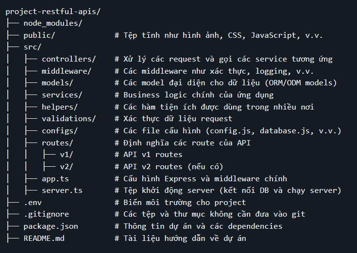

$${\color{red}////////}$$

# Stack

# Dependencies


# Initiate project
Initiate:
```
pnpm init
```
Install ExpressJs:
```
pnpm install express  --save
```
Install TypeScript:
```
pnpm i -D typescript  @types/express @types/node ts-node-dev
```
Install dotenv:
```
npm install express dotenv --save
```
# Create Directory


# Config
Create tsconfig.json:
```
npx tsc --init
```
Edit tsconfig.json:
```
{
  "compilerOptions": {
    "target": "es2016",
    "module": "commonjs",
    "outDir": "dist/",
    "strict": true,
    "sourceMap": true,
    "esModuleInterop": true,
    "skipLibCheck": true,
    "forceConsistentCasingInFileNames": true
  },
  "include": ["src/**/*", "server.ts", "index.d.ts"],
  "exclude": ["node_modules", "**/*.spec.ts"]
}
```
Edit package.json:
```
"scripts": {
    "build": "npx tsc -p",
    "start": "node app.ts",
    "dev": "ts-node-dev --respawn --transpile-only src/app.ts"
  },
```
# Development Process
Init
Create http responses (test with response text and static object)